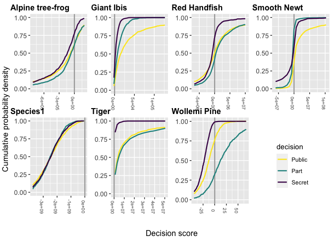
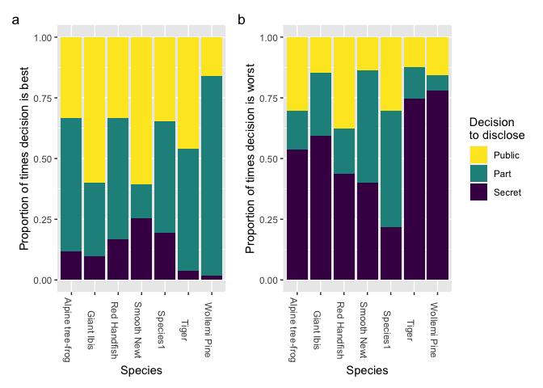
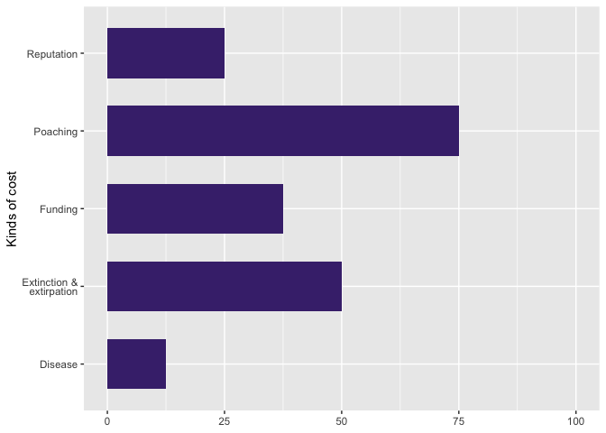

    library(dplyr)

    ## 
    ## Attaching package: 'dplyr'

    ## The following objects are masked from 'package:stats':
    ## 
    ##     filter, lag

    ## The following objects are masked from 'package:base':
    ## 
    ##     intersect, setdiff, setequal, union

    library(ggplot2)
    library(tidyr)
    library(stringr)
    library(readxl)
    library(viridis)

    ## Loading required package: viridisLite

    library(patchwork)
    library(magrittr)

    ## 
    ## Attaching package: 'magrittr'

    ## The following object is masked from 'package:tidyr':
    ## 
    ##     extract

    library(purrr)

    ## 
    ## Attaching package: 'purrr'

    ## The following object is masked from 'package:magrittr':
    ## 
    ##     set_names

    library(extraDistr)

    ## 
    ## Attaching package: 'extraDistr'

    ## The following object is masked from 'package:purrr':
    ## 
    ##     rdunif

    library(ggforce)
    library(cowplot)

    ## 
    ## Attaching package: 'cowplot'

    ## The following object is masked from 'package:patchwork':
    ## 
    ##     align_plots

    library(gridExtra)

    ## 
    ## Attaching package: 'gridExtra'

    ## The following object is masked from 'package:dplyr':
    ## 
    ##     combine

Load functions

    source("functions/calculate.zeta.R")
    source("functions/cumulative.density.R")
    source("functions/find.b.R")
    source("functions/find.lambda.R")
    source("functions/find.sigma.R")
    source("functions/plot_cd_wide_zoom.R")
    source("functions/plot_cd_zoom.R")
    source("functions/sample.fun.R")

Set seed

    set.seed(1984)

# Example scenarios

Load data. Data available from download at [DOI:
10.26188/11357126](https://dx.doi/10.26188/11357126)

    example_data <- readxl::read_xlsx(
      path = "data/species_publicity_data.xlsx",
      sheet = "example_case_studies"
    )

    example_data

    ## # A tibble: 20 × 7
    ##    species               disclose involve  probability_of_leaking   cost benefit
    ##    <chr>                 <chr>    <chr>                     <dbl>  <dbl>   <dbl>
    ##  1 Sp.1 illegal value    Secret   Governm…                   0.01 1   e4 1000000
    ##  2 Sp.1 illegal value    Part     Governm…                   0.4  1.5 e6 1000000
    ##  3 Sp.1 illegal value    Secret   Local c…                   0.1  1   e4 1200000
    ##  4 Sp.1 illegal value    Part     Local c…                   0.7  1.5 e6 1200000
    ##  5 Sp.1 illegal value    Public   Public                     1    5   e6 3000000
    ##  6 Sp.2 tourism value    Secret   Governm…                   0.01 2   e4  200000
    ##  7 Sp.2 tourism value    Part     Governm…                   0.6  4   e6 1500000
    ##  8 Sp.2 tourism value    Secret   Local c…                   0.05 2   e4 2500000
    ##  9 Sp.2 tourism value    Part     Local c…                   0.8  4   e6 2500000
    ## 10 Sp.2 tourism value    Public   Public                     1    4.50e6 5000000
    ## 11 Sp.3 intrinsic value  Secret   Governm…                   0.01 2   e4   10000
    ## 12 Sp.3 intrinsic value  Part     Governm…                   0.05 2   e4   10000
    ## 13 Sp.3 intrinsic value  Secret   Local c…                   0.02 2   e4   15000
    ## 14 Sp.3 intrinsic value  Part     Local c…                   0.1  2   e4   15000
    ## 15 Sp.3 intrinsic value  Public   Public                     1    2   e4   20000
    ## 16 Sp.4 invasive species Secret   Governm…                   0.01 5   e5  500000
    ## 17 Sp.4 invasive species Part     Governm…                   0.5  1.5 e6  500000
    ## 18 Sp.4 invasive species Secret   Local c…                   0.02 5   e5 1500000
    ## 19 Sp.4 invasive species Part     Local c…                   0.7  1.5 e6 1500000
    ## 20 Sp.4 invasive species Public   Public                     1    5   e6 2000000
    ## # ℹ 1 more variable: cost_of_publicity <dbl>

Calculate decision score, zeta, for each option

    example_results <- example_data %>%
      as_tibble %>%
      mutate(
        zeta = benefit - cost - probability_of_leaking*(cost_of_publicity - cost),
        involve = factor(
          involve,
          levels = c(
            "Government",
            "Local community group",
            "Public"
          )
        ),
        involve = recode(
          involve,
          "Local community group" = "Local community\ngroup",
        ),
        disclose = factor(
          disclose,
          levels = c(
            "Public",
            "Part",
            "Secret"
          ),
        )
      ) %>%
      group_by(species) %>%
      mutate(
        maxval = max(zeta)
      ) %>%
      ungroup %>%
      mutate(
        optimal = ifelse(
          zeta == maxval,
          "optimal",
          "not optimal"
        )
      ) %>%
      select(-maxval)

    example_results

    ## # A tibble: 20 × 9
    ##    species               disclose involve  probability_of_leaking   cost benefit
    ##    <chr>                 <fct>    <fct>                     <dbl>  <dbl>   <dbl>
    ##  1 Sp.1 illegal value    Secret   "Govern…                   0.01 1   e4 1000000
    ##  2 Sp.1 illegal value    Part     "Govern…                   0.4  1.5 e6 1000000
    ##  3 Sp.1 illegal value    Secret   "Local …                   0.1  1   e4 1200000
    ##  4 Sp.1 illegal value    Part     "Local …                   0.7  1.5 e6 1200000
    ##  5 Sp.1 illegal value    Public   "Public"                   1    5   e6 3000000
    ##  6 Sp.2 tourism value    Secret   "Govern…                   0.01 2   e4  200000
    ##  7 Sp.2 tourism value    Part     "Govern…                   0.6  4   e6 1500000
    ##  8 Sp.2 tourism value    Secret   "Local …                   0.05 2   e4 2500000
    ##  9 Sp.2 tourism value    Part     "Local …                   0.8  4   e6 2500000
    ## 10 Sp.2 tourism value    Public   "Public"                   1    4.50e6 5000000
    ## 11 Sp.3 intrinsic value  Secret   "Govern…                   0.01 2   e4   10000
    ## 12 Sp.3 intrinsic value  Part     "Govern…                   0.05 2   e4   10000
    ## 13 Sp.3 intrinsic value  Secret   "Local …                   0.02 2   e4   15000
    ## 14 Sp.3 intrinsic value  Part     "Local …                   0.1  2   e4   15000
    ## 15 Sp.3 intrinsic value  Public   "Public"                   1    2   e4   20000
    ## 16 Sp.4 invasive species Secret   "Govern…                   0.01 5   e5  500000
    ## 17 Sp.4 invasive species Part     "Govern…                   0.5  1.5 e6  500000
    ## 18 Sp.4 invasive species Secret   "Local …                   0.02 5   e5 1500000
    ## 19 Sp.4 invasive species Part     "Local …                   0.7  1.5 e6 1500000
    ## 20 Sp.4 invasive species Public   "Public"                   1    5   e6 2000000
    ## # ℹ 3 more variables: cost_of_publicity <dbl>, zeta <dbl>, optimal <chr>

Plot results from examples scenarios in figure 1.

    figure_1 <- ggplot(example_results) +
      geom_hline(
        yintercept = 0,
        colour = "darkgrey"
      ) +
      geom_point(
        aes(
          x = disclose,
          y = zeta,
          colour = involve#,
          #shape = optimal,
          #size = optimal
        ),
        size = 4#,
        # position = position_dodge(
        #   width = 0.1
        # )
      ) +
      facet_wrap(
        facets = ~ species,
        nrow = 2,
        scales = "free_y"
      ) +
      theme_grey() +
      theme(
        axis.ticks.y = element_blank(),
        axis.text.y = element_blank(),
        axis.title.y = element_text(
          angle = 0
        ),
        axis.text.x = element_text(
          angle = 270
        )#,
        #legend.position = "bottom"
      ) +
      ylab("Decision\nscore") +
      xlab("Decision to disclose") +
      scale_colour_manual(
        values = plasma(11)[c(2,6,10)],
        guide = guide_legend(
          title = "Decision to\ninvolve",
          direction = "vertical"
        )
      ) #+
      # scale_shape_manual(
      #   values = c(19, 17),
      #   guide = guide_legend(
      #     title = "Decision is\noptimal?",
      #     direction = "vertical"
      #   )
      # ) +
      # scale_size_manual(
      #   values = c(4, 5),
      #   guide = guide_legend(
      #     title = "Decision is\noptimal?",
      #     direction = "vertical"
      #   )
      # ) 

    figure_1

    png(
      filename = "plots/figure_1.png",
      width = 20,
      height = 12.5,
      units = "cm",
      res = 300
    )
    figure_1
    dev.off()

    ## quartz_off_screen 
    ##                 2

    table_s2 <- example_results %>%
      select(species, disclose, involve, zeta) %>% 
      pivot_wider(
        names_from = disclose,
        values_from = zeta
      ) %>%
      arrange(species, involve)

    table_s2

    ## # A tibble: 12 × 5
    ##    species               involve                   Secret     Part   Public
    ##    <chr>                 <fct>                      <dbl>    <dbl>    <dbl>
    ##  1 Sp.1 illegal value    "Government"              940100 -1900000       NA
    ##  2 Sp.1 illegal value    "Local community\ngroup"  691000 -2750000       NA
    ##  3 Sp.1 illegal value    "Public"                      NA       NA -2000000
    ##  4 Sp.2 tourism value    "Government"              135200 -2800000       NA
    ##  5 Sp.2 tourism value    "Local community\ngroup" 2256000 -1900000       NA
    ##  6 Sp.2 tourism value    "Public"                      NA       NA   500000
    ##  7 Sp.3 intrinsic value  "Government"              -10000   -10000       NA
    ##  8 Sp.3 intrinsic value  "Local community\ngroup"   -5000    -5000       NA
    ##  9 Sp.3 intrinsic value  "Public"                      NA       NA        0
    ## 10 Sp.4 invasive species "Government"              -45000 -2750000       NA
    ## 11 Sp.4 invasive species "Local community\ngroup"  910000 -2450000       NA
    ## 12 Sp.4 invasive species "Public"                      NA       NA -3000000

    write.csv(
      x = table_s2,
      file = "output/table_s2.csv",
      row.names = FALSE
    )

# Questionnaire numeric estimates of cost and benefits

Read in numeric questionnaire data. As above, data available from
download at [DOI: 10.26188/11357126](https://dx.doi/10.26188/11357126)

    numeric_data <- readxl::read_xlsx(
      path = "data/species_publicity_data.xlsx",
      sheet = "questionnaire_numeric"
    )

    numeric_data[ , which(substr(colnames(numeric_data), 1,1) == "q")] <- apply(
      X = numeric_data[ , which(substr(colnames(numeric_data), 1,1) == "q")],
      MARGIN = 2,
      FUN = as.numeric
    )

    ## Warning in apply(X = numeric_data[, which(substr(colnames(numeric_data), : NAs
    ## introduced by coercion

    ## Warning in apply(X = numeric_data[, which(substr(colnames(numeric_data), : NAs
    ## introduced by coercion

    ## Warning in apply(X = numeric_data[, which(substr(colnames(numeric_data), : NAs
    ## introduced by coercion

    ## Warning in apply(X = numeric_data[, which(substr(colnames(numeric_data), : NAs
    ## introduced by coercion

    ## Warning in apply(X = numeric_data[, which(substr(colnames(numeric_data), : NAs
    ## introduced by coercion

    ## Warning in apply(X = numeric_data[, which(substr(colnames(numeric_data), : NAs
    ## introduced by coercion

    ## Warning in apply(X = numeric_data[, which(substr(colnames(numeric_data), : NAs
    ## introduced by coercion

    ## Warning in apply(X = numeric_data[, which(substr(colnames(numeric_data), : NAs
    ## introduced by coercion

    ## Warning in apply(X = numeric_data[, which(substr(colnames(numeric_data), : NAs
    ## introduced by coercion

    ## Warning in apply(X = numeric_data[, which(substr(colnames(numeric_data), : NAs
    ## introduced by coercion

    ## Warning in apply(X = numeric_data[, which(substr(colnames(numeric_data), : NAs
    ## introduced by coercion

    ## Warning in apply(X = numeric_data[, which(substr(colnames(numeric_data), : NAs
    ## introduced by coercion

    ## Warning in apply(X = numeric_data[, which(substr(colnames(numeric_data), : NAs
    ## introduced by coercion

    ## Warning in apply(X = numeric_data[, which(substr(colnames(numeric_data), : NAs
    ## introduced by coercion

    ## Warning in apply(X = numeric_data[, which(substr(colnames(numeric_data), : NAs
    ## introduced by coercion

    ## Warning in apply(X = numeric_data[, which(substr(colnames(numeric_data), : NAs
    ## introduced by coercion

    ## Warning in apply(X = numeric_data[, which(substr(colnames(numeric_data), : NAs
    ## introduced by coercion

    ## Warning in apply(X = numeric_data[, which(substr(colnames(numeric_data), : NAs
    ## introduced by coercion

    ## Warning in apply(X = numeric_data[, which(substr(colnames(numeric_data), : NAs
    ## introduced by coercion

    ## Warning in apply(X = numeric_data[, which(substr(colnames(numeric_data), : NAs
    ## introduced by coercion

    ## Warning in apply(X = numeric_data[, which(substr(colnames(numeric_data), : NAs
    ## introduced by coercion

    ## Warning in apply(X = numeric_data[, which(substr(colnames(numeric_data), : NAs
    ## introduced by coercion

    ## Warning in apply(X = numeric_data[, which(substr(colnames(numeric_data), : NAs
    ## introduced by coercion

    ## Warning in apply(X = numeric_data[, which(substr(colnames(numeric_data), : NAs
    ## introduced by coercion

    ## Warning in apply(X = numeric_data[, which(substr(colnames(numeric_data), : NAs
    ## introduced by coercion

    ## Warning in apply(X = numeric_data[, which(substr(colnames(numeric_data), : NAs
    ## introduced by coercion

    numeric_data

    ## # A tibble: 8 × 32
    ##   status currency   consent_sp_id species    consent_sp_loc sp_loc q1.1.1 q1.1.2
    ##   <chr>  <chr>      <chr>         <chr>      <chr>          <chr>   <dbl>  <dbl>
    ## 1 part   AUD        Y             Alpine tr… N              Locat…  25000  4  e5
    ## 2 part   USD        Y             Giant Ibis Y              Asia     1000  2  e4
    ## 3 part   AUD        Y             Red Handf… Y              Austr…      0  2  e6
    ## 4 part   AUD        y             Smooth Ne… y              Austr…      0  1  e6
    ## 5 not    USD        N             Species1   N              Locat…  50000  1.5e7
    ## 6 not    NA         N             Species2   N              Locat…     NA NA    
    ## 7 part   USD        Y             Tiger      Y              Asia    50000  2  e7
    ## 8 part   percentage y             Wollemi P… y              Austr…      0  5  e1
    ## # ℹ 24 more variables: q1.1.3 <dbl>, q1.1.4 <dbl>, q1.2.1 <dbl>, q1.2.2 <dbl>,
    ## #   q1.2.3 <dbl>, q1.2.4 <dbl>, q2.1.1 <dbl>, q2.1.2 <dbl>, q2.1.3 <dbl>,
    ## #   q2.1.4 <dbl>, q2.2.1 <dbl>, q2.2.2 <dbl>, q2.2.3 <dbl>, q2.2.4 <dbl>,
    ## #   q2.3 <dbl>, q3.1.1 <dbl>, q3.1.2 <dbl>, q3.1.3 <dbl>, q3.1.4 <dbl>,
    ## #   q3.2.1 <dbl>, q3.2.2 <dbl>, q3.2.3 <dbl>, q3.2.4 <dbl>, q3.3 <dbl>

Transform to long format and tidy

    numdat <- numeric_data %>%
      select(
        -status,
        -currency,
        -consent_sp_id,
        -consent_sp_loc,
        -sp_loc
      ) %>%
      pivot_longer(
        cols = starts_with("q"),
        names_to = "question",
      ) %>%
      mutate(
        decision = substr(
          x = question,
          start = 2,
          stop = 2
        ) %>%
          as.integer,
        type = substr(
          x = question,
          start = 4,
          stop = 4
        ) %>%
          as.integer,
        estimate = substr(
          x = question,
          start = 6,
          stop = 6
        ) %>%
          as.integer
      ) %>%
      mutate(
        decision = case_when(
          decision == 1 ~ "Public",
          decision == 2 ~ "Part",
          decision == 3 ~ "Secret"
        ),
        decision = factor(
          x = decision,
          levels = c(
            "Public",
            "Part",
            "Secret"
          )
        ),
        type = case_when(
          type == 1 ~ "Benefit",
          type == 2 ~ "Cost",
          type == 3 ~ "pd"
        ),
        estimate = case_when(
          estimate == 1 ~ "lower",
          estimate == 2 ~ "upper",
          estimate == 3 ~ "most.likely",
          estimate == 4 ~ "pconf"
        )
      ) %>%
      select(
        species,
        decision,
        type,
        estimate,
        value
      ) %>%
      filter(
        species != "Species2"
      )

    numdat

    ## # A tibble: 182 × 5
    ##    species          decision type    estimate      value
    ##    <chr>            <fct>    <chr>   <chr>         <dbl>
    ##  1 Alpine tree-frog Public   Benefit lower         25000
    ##  2 Alpine tree-frog Public   Benefit upper        400000
    ##  3 Alpine tree-frog Public   Benefit most.likely  150000
    ##  4 Alpine tree-frog Public   Benefit pconf            90
    ##  5 Alpine tree-frog Public   Cost    lower             0
    ##  6 Alpine tree-frog Public   Cost    upper       1000000
    ##  7 Alpine tree-frog Public   Cost    most.likely  100000
    ##  8 Alpine tree-frog Public   Cost    pconf            90
    ##  9 Alpine tree-frog Part     Benefit lower         25000
    ## 10 Alpine tree-frog Part     Benefit upper        400000
    ## # ℹ 172 more rows

Separate out cost and benefit data, widen format, and determine type of
distribution to be fit to estimates.

*Where values are not given for some parameters (in the case of the
Wollemi pine), the most likely value is imputed as the arithmetic mean
of the upper and lower values, and the confidence that the value between
the upper and lower bounds is given as 0.95.*

    cost_benefit <- numdat %>%
      filter(type != "pd") %>%
      pivot_wider(
        names_from = estimate,
        values_from = value
      ) %>%
      mutate(
        pconf = pconf/100
      ) %>%
      filter(species != "Species2") %>%
      mutate(
        most.likely = ifelse(
          test = is.na(most.likely),
          yes = (upper - lower)/2,
          no = most.likely
        ),
        pconf = ifelse(
          test = is.na(pconf),
          yes = 0.95,
          no = pconf
        ),
        dist = case_when(
          pconf == 1 ~ "triangular",
          lower == most.likely & lower != 0 & pconf > 0.5 ~ "triangular",
          lower == most.likely ~ "exponential",
          TRUE ~ "lognormal"
        )
      )

    cost_benefit

    ## # A tibble: 42 × 8
    ##    species          decision type    lower   upper most.likely pconf dist       
    ##    <chr>            <fct>    <chr>   <dbl>   <dbl>       <dbl> <dbl> <chr>      
    ##  1 Alpine tree-frog Public   Benefit 25000  400000      150000   0.9 lognormal  
    ##  2 Alpine tree-frog Public   Cost        0 1000000      100000   0.9 lognormal  
    ##  3 Alpine tree-frog Part     Benefit 25000  400000      100000   0.9 lognormal  
    ##  4 Alpine tree-frog Part     Cost        0  200000       50000   0.9 lognormal  
    ##  5 Alpine tree-frog Secret   Benefit 25000  300000       25000   0.9 triangular 
    ##  6 Alpine tree-frog Secret   Cost        0  200000           0   0.9 exponential
    ##  7 Giant Ibis       Public   Benefit  1000   20000        2000   0.5 lognormal  
    ##  8 Giant Ibis       Public   Cost        0    2000           0   0.5 exponential
    ##  9 Giant Ibis       Part     Benefit     0   10000           0   0.5 exponential
    ## 10 Giant Ibis       Part     Cost        0    2000           0   0.8 exponential
    ## # ℹ 32 more rows

Estimate parameters for lognormal distributions

    cost_benefit_lognormal <- cost_benefit %>%
      filter(dist == "lognormal") %>%
      mutate(
        value = pmap(
          .l = list(
            lower = lower,
            most.likely = most.likely,
            upper = upper,
            p = pconf
          ),
          .f = find.sigma,
          print.sigma = FALSE
        )
      ) %>%
      unnest(value)

    cost_benefit_lognormal

    ## # A tibble: 29 × 9
    ##    species          decision type    lower   upper most.likely pconf dist  value
    ##    <chr>            <fct>    <chr>   <dbl>   <dbl>       <dbl> <dbl> <chr> <dbl>
    ##  1 Alpine tree-frog Public   Benefit 25000  400000      150000   0.9 logn… 0.539
    ##  2 Alpine tree-frog Public   Cost        0 1000000      100000   0.9 logn… 1.01 
    ##  3 Alpine tree-frog Part     Benefit 25000  400000      100000   0.9 logn… 0.694
    ##  4 Alpine tree-frog Part     Cost        0  200000       50000   0.9 logn… 0.700
    ##  5 Giant Ibis       Public   Benefit  1000   20000        2000   0.5 logn… 1.49 
    ##  6 Red Handfish     Public   Benefit     0 2000000      250000   0.5 logn… 1.44 
    ##  7 Red Handfish     Public   Cost    20000 2000000      500000   0.5 logn… 1.18 
    ##  8 Red Handfish     Part     Benefit     0 2000000      250000   0.5 logn… 1.44 
    ##  9 Red Handfish     Part     Cost        0  500000       20000   0.5 logn… 1.79 
    ## 10 Red Handfish     Secret   Benefit     0  500000       75000   0.5 logn… 1.38 
    ## # ℹ 19 more rows

Estimate parameters for exponential distributions

    cost_benefit_exponential <- cost_benefit %>%
      filter(dist == "exponential") %>%
      mutate(
        value = pmap(
          .l = list(
            lower = lower,
            upper = upper,
            p = pconf
          ),
          .f = find.lambda,
        )
      ) %>%
      unnest(value)

    cost_benefit_exponential

    ## # A tibble: 9 × 9
    ##   species          decision type    lower  upper most.likely pconf dist    value
    ##   <chr>            <fct>    <chr>   <dbl>  <dbl>       <dbl> <dbl> <chr>   <dbl>
    ## 1 Alpine tree-frog Secret   Cost        0 200000           0   0.9 expo… 1.15e-5
    ## 2 Giant Ibis       Public   Cost        0   2000           0   0.5 expo… 3.47e-4
    ## 3 Giant Ibis       Part     Benefit     0  10000           0   0.5 expo… 6.93e-5
    ## 4 Giant Ibis       Part     Cost        0   2000           0   0.8 expo… 8.05e-4
    ## 5 Giant Ibis       Secret   Benefit     0  10000           0   0.8 expo… 1.61e-4
    ## 6 Giant Ibis       Secret   Cost        0   2000           0   0.8 expo… 8.05e-4
    ## 7 Tiger            Public   Cost        0 180000           0   0.3 expo… 1.98e-6
    ## 8 Tiger            Part     Cost        0 180000           0   0.3 expo… 1.98e-6
    ## 9 Tiger            Secret   Cost        0 180000           0   0.3 expo… 1.98e-6

Estimate parameters for triangular distributions

    cost_benefit_triangular <- cost_benefit %>%
      filter(dist == "triangular") %>%
      mutate(
        value = pmap(
          .l = list(
            lower = lower,
            most.likely = most.likely,
            upper = upper,
            p = pconf
          ),
          .f = find.b,
        )
      ) %>%
      unnest(value)

    cost_benefit_triangular

    ## # A tibble: 4 × 9
    ##   species          decision type    lower   upper most.likely pconf dist   value
    ##   <chr>            <fct>    <chr>   <dbl>   <dbl>       <dbl> <dbl> <chr>  <dbl>
    ## 1 Alpine tree-frog Secret   Benefit 25000     3e5       25000   0.9 tria… 3.61e5
    ## 2 Species1         Public   Cost        0     5e9  2500000000   1   tria… 5   e9
    ## 3 Species1         Part     Cost        0     5e9  2500000000   1   tria… 5   e9
    ## 4 Species1         Secret   Cost        0     5e9  2500000000   1   tria… 5   e9

Number of random samples to take from distributions

    nsamples <- 1000

Bind cost benefit data data back together and sample distributions for
each variable

    cost_benefit_all <- bind_rows(
      cost_benefit_lognormal,
      cost_benefit_exponential,
      cost_benefit_triangular
    ) %>%
       mutate(
        samples = pmap(
          .l = list(
            dist = dist,
            most.likely = most.likely,
            value = value
          ),
          .f = sample.fun,
          n = nsamples
        )
      ) 

    cost_benefit_all

    ## # A tibble: 42 × 10
    ##    species      decision type  lower upper most.likely pconf dist  value samples
    ##    <chr>        <fct>    <chr> <dbl> <dbl>       <dbl> <dbl> <chr> <dbl> <list> 
    ##  1 Alpine tree… Public   Bene… 25000   4e5      150000   0.9 logn… 0.539 <dbl>  
    ##  2 Alpine tree… Public   Cost      0   1e6      100000   0.9 logn… 1.01  <dbl>  
    ##  3 Alpine tree… Part     Bene… 25000   4e5      100000   0.9 logn… 0.694 <dbl>  
    ##  4 Alpine tree… Part     Cost      0   2e5       50000   0.9 logn… 0.700 <dbl>  
    ##  5 Giant Ibis   Public   Bene…  1000   2e4        2000   0.5 logn… 1.49  <dbl>  
    ##  6 Red Handfish Public   Bene…     0   2e6      250000   0.5 logn… 1.44  <dbl>  
    ##  7 Red Handfish Public   Cost  20000   2e6      500000   0.5 logn… 1.18  <dbl>  
    ##  8 Red Handfish Part     Bene…     0   2e6      250000   0.5 logn… 1.44  <dbl>  
    ##  9 Red Handfish Part     Cost      0   5e5       20000   0.5 logn… 1.79  <dbl>  
    ## 10 Red Handfish Secret   Bene…     0   5e5       75000   0.5 logn… 1.38  <dbl>  
    ## # ℹ 32 more rows

Table s3. Generate table of statistical distributions and parameters
used for sampling

    distribution_table <- cost_benefit_all %>%
      select(
        species,
        decision,
        type,
        lower,
        most.likely,
        everything(),
        -samples
      ) %>%
      mutate(
        sigma = ifelse(
          dist == "lognormal",
          value,
          NA
        ),
        mu = ifelse(
          dist == "lognormal",
          log(most.likely) + sigma^2,
          NA
        ),
        lambda = ifelse(
          dist == "exponential",
          value,
          NA
        ),
        a = ifelse(
          dist == "triangular",
          0,
          NA
        ),
        b = ifelse(
          dist == "triangular",
          value,
          NA
        ),
        c = ifelse(
          dist == "triangular",
          most.likely,
          NA
        )
      ) %>%
      select(
        -value
      ) %>%
      arrange(species, decision, type)

    distribution_table

    ## # A tibble: 42 × 14
    ##    species       decision type  lower most.likely upper pconf dist   sigma    mu
    ##    <chr>         <fct>    <chr> <dbl>       <dbl> <dbl> <dbl> <chr>  <dbl> <dbl>
    ##  1 Alpine tree-… Public   Bene… 25000      150000   4e5   0.9 logn…  0.539 12.2 
    ##  2 Alpine tree-… Public   Cost      0      100000   1e6   0.9 logn…  1.01  12.5 
    ##  3 Alpine tree-… Part     Bene… 25000      100000   4e5   0.9 logn…  0.694 12.0 
    ##  4 Alpine tree-… Part     Cost      0       50000   2e5   0.9 logn…  0.700 11.3 
    ##  5 Alpine tree-… Secret   Bene… 25000       25000   3e5   0.9 tria… NA     NA   
    ##  6 Alpine tree-… Secret   Cost      0           0   2e5   0.9 expo… NA     NA   
    ##  7 Giant Ibis    Public   Bene…  1000        2000   2e4   0.5 logn…  1.49   9.81
    ##  8 Giant Ibis    Public   Cost      0           0   2e3   0.5 expo… NA     NA   
    ##  9 Giant Ibis    Part     Bene…     0           0   1e4   0.5 expo… NA     NA   
    ## 10 Giant Ibis    Part     Cost      0           0   2e3   0.8 expo… NA     NA   
    ## # ℹ 32 more rows
    ## # ℹ 4 more variables: lambda <dbl>, a <dbl>, b <dbl>, c <dbl>

Write out table s3

    write.csv(
      x = distribution_table,
      file = "output/table_s3.csv",
      row.names = FALSE
    )

Probability information becomes public given a decision, pd.

    pd_all <- numdat %>%
      filter(type == "pd") %>%
      mutate(
        pd = value/100
      ) %>%
      select(
        species,
        decision,
        pd
      )

    pd_all

    ## # A tibble: 14 × 3
    ##    species          decision    pd
    ##    <chr>            <fct>    <dbl>
    ##  1 Alpine tree-frog Part      0.7 
    ##  2 Alpine tree-frog Secret    0.9 
    ##  3 Giant Ibis       Part      0.95
    ##  4 Giant Ibis       Secret    0.95
    ##  5 Red Handfish     Part      0.3 
    ##  6 Red Handfish     Secret    0.3 
    ##  7 Smooth Newt      Part      0.1 
    ##  8 Smooth Newt      Secret    0.1 
    ##  9 Species1         Part      0.3 
    ## 10 Species1         Secret    0.85
    ## 11 Tiger            Part      0.1 
    ## 12 Tiger            Secret    0.1 
    ## 13 Wollemi Pine     Part      0.7 
    ## 14 Wollemi Pine     Secret    0.8

Cost if a decision is public, Cp

    cost_public <- cost_benefit_all %>%
      filter(decision == "Public") %>%
      filter(type == "Cost") %>%
      select(
        species,
        Cost_public = samples
      )

    cost_public

    ## # A tibble: 7 × 2
    ##   species          Cost_public  
    ##   <chr>            <list>       
    ## 1 Alpine tree-frog <dbl [1,000]>
    ## 2 Red Handfish     <dbl [1,000]>
    ## 3 Smooth Newt      <dbl [1,000]>
    ## 4 Wollemi Pine     <dbl [1,000]>
    ## 5 Giant Ibis       <dbl [1,000]>
    ## 6 Tiger            <dbl [1,000]>
    ## 7 Species1         <dbl [1,000]>

Calculate estimates of decision score zeta from samples

    zeta_estimates <- cost_benefit_all %>%
      pivot_wider(
        id_cols = c(
          species, decision
        ),
        names_from = type,
        values_from = samples
      ) %>%
      arrange(
        species, decision
      ) %>%
      full_join(
        cost_public
      ) %>%
      full_join(
        pd_all
      ) %>%
      mutate(
        pd = ifelse(
          test = is.na(pd),
          yes = 1,
          pd
        )
      ) %>%
      mutate(
        id = list(1:nsamples)
      ) %>%
      unnest(
        cols = c(
          Benefit,
          Cost,
          Cost_public,
          id
        )
      ) %>%
      mutate(
        zeta = pmap(
          .l = list(
            Bd = Benefit,
            Cd = Cost,
            pd = pd,
            Cp = Cost_public
          ),
          .f = calculate.zeta
        )
      ) %>%
      unnest(zeta) 

    ## Joining with `by = join_by(species)`
    ## Joining with `by = join_by(species, decision)`

    zeta_estimates

    ## # A tibble: 21,000 × 8
    ##    species          decision Benefit     Cost Cost_public    pd    id      zeta
    ##    <chr>            <fct>      <dbl>    <dbl>       <dbl> <dbl> <int>     <dbl>
    ##  1 Alpine tree-frog Public   249966.  743741.     743741.     1     1  -493774.
    ##  2 Alpine tree-frog Public   168485.   75283.      75283.     1     2    93202.
    ##  3 Alpine tree-frog Public   282430. 4141165.    4141165.     1     3 -3858735.
    ##  4 Alpine tree-frog Public    74165.  354584.     354584.     1     4  -280419.
    ##  5 Alpine tree-frog Public   335171.  197669.     197669.     1     5   137501.
    ##  6 Alpine tree-frog Public   380375.  823540.     823540.     1     6  -443165.
    ##  7 Alpine tree-frog Public   268571.   56734.      56734.     1     7   211837.
    ##  8 Alpine tree-frog Public   128029. 1162845.    1162845.     1     8 -1034816.
    ##  9 Alpine tree-frog Public   151016.  326812.     326812.     1     9  -175796.
    ## 10 Alpine tree-frog Public   429971.  119733.     119733.     1    10   310238.
    ## # ℹ 20,990 more rows

Minimum and maximum decision scores

    zeta_estimates_minmax <- zeta_estimates %>%
      group_by(species) %>%
      summarise(
        min = min(zeta),
        max = max(zeta)
      )

    zeta_estimates_minmax

    ## # A tibble: 7 × 3
    ##   species                   min         max
    ##   <chr>                   <dbl>       <dbl>
    ## 1 Alpine tree-frog   -10771102.     995816.
    ## 2 Giant Ibis            -15183.    2710603.
    ## 3 Red Handfish      -243881039.  260351032.
    ## 4 Smooth Newt      -3145197000. 4212672581.
    ## 5 Species1         -4817806433.  -66031187.
    ## 6 Tiger               -3106170. 2054082710.
    ## 7 Wollemi Pine            -130.        223.

Sequential values from min to max along each range

    zeta_ranges <- zeta_estimates_minmax %$%
      mapply(
        FUN = seq,
        from = min,
        to = max,
        MoreArgs = list(
          length.out = 1000
        )
      )

    colnames(zeta_ranges) <- zeta_estimates_minmax$species

    zeta_ranges <- zeta_ranges %>%
      as_tibble %>%
      pivot_longer(
        cols = everything(),
        names_to = "species",
        values_to = "value"
      ) %>%
      arrange(species, value)

    zeta_ranges

    ## # A tibble: 7,000 × 2
    ##    species               value
    ##    <chr>                 <dbl>
    ##  1 Alpine tree-frog -10771102.
    ##  2 Alpine tree-frog -10759324.
    ##  3 Alpine tree-frog -10747545.
    ##  4 Alpine tree-frog -10735766.
    ##  5 Alpine tree-frog -10723988.
    ##  6 Alpine tree-frog -10712209.
    ##  7 Alpine tree-frog -10700430.
    ##  8 Alpine tree-frog -10688651.
    ##  9 Alpine tree-frog -10676873.
    ## 10 Alpine tree-frog -10665094.
    ## # ℹ 6,990 more rows

Calculate the cumlative density for each decision scenario at each value
for each species

    zeta_cd_wide <- zeta_ranges %>%
      rowwise %>%
      mutate(
        Public = cumulative.density(
          species,
          value,
          data = zeta_estimates,
          nsamples = nsamples,
          decision = "Public"
        ),
        Part = cumulative.density(
          species,
          value,
          data = zeta_estimates,
          nsamples = nsamples,
          decision = "Part"
        ),
        Secret = cumulative.density(
          species,
          value,
          data = zeta_estimates,
          nsamples = nsamples,
          decision = "Secret"
        )
      ) 

    zeta_cd_wide

    ## # A tibble: 7,000 × 5
    ## # Rowwise: 
    ##    species               value Public  Part Secret
    ##    <chr>                 <dbl>  <dbl> <dbl>  <dbl>
    ##  1 Alpine tree-frog -10771102.  0.001     0      0
    ##  2 Alpine tree-frog -10759324.  0.001     0      0
    ##  3 Alpine tree-frog -10747545.  0.001     0      0
    ##  4 Alpine tree-frog -10735766.  0.001     0      0
    ##  5 Alpine tree-frog -10723988.  0.001     0      0
    ##  6 Alpine tree-frog -10712209.  0.001     0      0
    ##  7 Alpine tree-frog -10700430.  0.001     0      0
    ##  8 Alpine tree-frog -10688651.  0.001     0      0
    ##  9 Alpine tree-frog -10676873.  0.001     0      0
    ## 10 Alpine tree-frog -10665094.  0.001     0      0
    ## # ℹ 6,990 more rows

    zeta_dominance <- zeta_cd_wide %>%
      group_by(species) %>%
      summarise(
        Public_Part   = sum(Public <= Part)   == nsamples,
        Public_Secret = sum(Public <= Secret) == nsamples,
        Part_Public   = sum(Part <= Public)   == nsamples,
        Part_Secret   = sum(Part <= Secret)   == nsamples,
        Secret_Public = sum(Secret <= Public) == nsamples,
        Secret_Part   = sum(Secret <= Part)   == nsamples
      ) %>%
      pivot_longer(
        cols = -species,
        names_to = "dominance",
        values_to = "dominates"
      ) %>%
      mutate(
        dominant = sub(
          pattern = "_.*",
          "",
          dominance
        ),
        dominated = sub(
          pattern = ".*_",
          "",
          dominance
        )
      ) %>%
      select(species, dominant, dominates, dominated) %>%
      pivot_wider(
        id_cols = c(species, dominant),
        names_from = dominated,
        values_from = dominates
      )

    zeta_dominance

    ## # A tibble: 21 × 5
    ##    species          dominant Part  Secret Public
    ##    <chr>            <chr>    <lgl> <lgl>  <lgl> 
    ##  1 Alpine tree-frog Public   FALSE FALSE  NA    
    ##  2 Alpine tree-frog Part     NA    TRUE   FALSE 
    ##  3 Alpine tree-frog Secret   FALSE NA     FALSE 
    ##  4 Giant Ibis       Public   FALSE FALSE  NA    
    ##  5 Giant Ibis       Part     NA    TRUE   FALSE 
    ##  6 Giant Ibis       Secret   FALSE NA     FALSE 
    ##  7 Red Handfish     Public   FALSE FALSE  NA    
    ##  8 Red Handfish     Part     NA    TRUE   FALSE 
    ##  9 Red Handfish     Secret   FALSE NA     FALSE 
    ## 10 Smooth Newt      Public   TRUE  TRUE   NA    
    ## # ℹ 11 more rows

    # write.csv(
    #   x = zeta_dominance,
    #   file = "output/table_s6.csv",
    #   row.names = FALSE
    # )

    Zeta_cd_limits <- zeta_estimates %>%
      group_by(species, decision) %>%
      summarise(
        low = quantile(
          x = zeta,
          probs = 0.1
        ),
        high = quantile(
          x = zeta,
          probs = 0.9
        )
      ) %>%
      group_by(species) %>%
      summarise(
        lower = min(low),
        upper = max(high)
      )

    ## `summarise()` has grouped output by 'species'. You can override using the
    ## `.groups` argument.

    Zeta_cd_limits

    ## # A tibble: 7 × 3
    ##   species                  lower         upper
    ##   <chr>                    <dbl>         <dbl>
    ## 1 Alpine tree-frog     -819595.       206249. 
    ## 2 Giant Ibis             -2896.       128277. 
    ## 3 Red Handfish        -6715366.     10284318. 
    ## 4 Smooth Newt        -62061768.    105136286. 
    ## 5 Species1         -3752510515.  -1084696699. 
    ## 6 Tiger                -692917.     50711880. 
    ## 7 Wollemi Pine             -44.3          67.4

Transform cumulative densitiy to long format for plotting

    zeta_cd <- zeta_cd_wide %>%
      pivot_longer(
        cols = c(Public, Part, Secret),
        names_to = "decision",
        values_to = "cd"
      ) %>%
      mutate(
        decision = factor(
          decision,
          levels = c(
            "Public",
            "Part",
            "Secret"
          )
        )
      )

    zeta_cd

    ## # A tibble: 21,000 × 4
    ##    species               value decision    cd
    ##    <chr>                 <dbl> <fct>    <dbl>
    ##  1 Alpine tree-frog -10771102. Public   0.001
    ##  2 Alpine tree-frog -10771102. Part     0    
    ##  3 Alpine tree-frog -10771102. Secret   0    
    ##  4 Alpine tree-frog -10759324. Public   0.001
    ##  5 Alpine tree-frog -10759324. Part     0    
    ##  6 Alpine tree-frog -10759324. Secret   0    
    ##  7 Alpine tree-frog -10747545. Public   0.001
    ##  8 Alpine tree-frog -10747545. Part     0    
    ##  9 Alpine tree-frog -10747545. Secret   0    
    ## 10 Alpine tree-frog -10735766. Public   0.001
    ## # ℹ 20,990 more rows

## Figure 2

    fig2_list <- mapply(
      FUN = plot_cd_zoom,
      species = unique(zeta_estimates$species),
       xlab = c(
        FALSE,
        FALSE,
        FALSE,
        FALSE,
        FALSE,
        FALSE,
        FALSE
      ),
      ylab = c(
        FALSE,
        FALSE,
        FALSE,
        FALSE,
        FALSE,
        FALSE,
        FALSE
      ),
      # xtext = c(
      #   FALSE,
      #   FALSE,
      #   FALSE,
      #   FALSE,
      #   FALSE,
      #   TRUE,
      #   TRUE
      # ),
      xtext = TRUE,
      MoreArgs = list(
        data = zeta_cd,
        limits = Zeta_cd_limits,
        textsize = 10
      ),
      SIMPLIFY = FALSE
    )

    ## Warning: Using `size` aesthetic for lines was deprecated in ggplot2 3.4.0.
    ## ℹ Please use `linewidth` instead.
    ## This warning is displayed once every 8 hours.
    ## Call `lifecycle::last_lifecycle_warnings()` to see where this warning was
    ## generated.

    fig2_list[[1]]

    ## Warning: Removed 2739 rows containing missing values (`geom_line()`).

    f2legend <- get_legend(fig2_list[[1]] + guides(col = guide_legend(ncol = 1))) 

    ## Warning: Removed 2739 rows containing missing values (`geom_line()`).

    figure_2 <- plot_grid(
      NULL,
      NULL,
      NULL,
      NULL,
      fig2_list[[1]] + scale_colour_manual(values = viridis(3)[3:1], guide = FALSE),
      fig2_list[[2]] + scale_colour_manual(values = viridis(3)[3:1], guide = FALSE),
      fig2_list[[3]] + scale_colour_manual(values = viridis(3)[3:1], guide = FALSE),
      fig2_list[[4]] + scale_colour_manual(values = viridis(3)[3:1], guide = FALSE),
      fig2_list[[5]] + scale_colour_manual(values = viridis(3)[3:1], guide = FALSE),
      fig2_list[[6]] + scale_colour_manual(values = viridis(3)[3:1], guide = FALSE),
      fig2_list[[7]] + scale_colour_manual(values = viridis(3)[3:1], guide = FALSE),
      f2legend,
      ncol = 4,
      align = "hv",
      labels = c(
        "",
        "",
        "",
        "",
        "Alpine tree-frog",
        "Giant Ibis",
        "Red Handfish",
        "Smooth Newt",
        "Species1",
        "Tiger",
        "Wollemi Pine"#,
        #""
      ),
      #label_fontface = "plain",
      label_size = 12,
      vjust = -0.01,
      hjust = 0,
      rel_heights = c(0.1, 1, 1),
      axis.titles = "collect"
    ) %>%
      grid.arrange(left = "Cumulative probability density", bottom = "Decision score")

    ## Scale for colour is already present.
    ## Adding another scale for colour, which will replace the existing scale.
    ## Scale for colour is already present.
    ## Adding another scale for colour, which will replace the existing scale.
    ## Scale for colour is already present.
    ## Adding another scale for colour, which will replace the existing scale.
    ## Scale for colour is already present.
    ## Adding another scale for colour, which will replace the existing scale.
    ## Scale for colour is already present.
    ## Adding another scale for colour, which will replace the existing scale.
    ## Scale for colour is already present.
    ## Adding another scale for colour, which will replace the existing scale.
    ## Scale for colour is already present.
    ## Adding another scale for colour, which will replace the existing scale.

    ## Warning: Removed 2739 rows containing missing values (`geom_line()`).

    ## Warning: The `guide` argument in `scale_*()` cannot be `FALSE`. This was deprecated in
    ## ggplot2 3.3.4.
    ## ℹ Please use "none" instead.
    ## This warning is displayed once every 8 hours.
    ## Call `lifecycle::last_lifecycle_warnings()` to see where this warning was
    ## generated.

    ## Warning: Removed 2856 rows containing missing values (`geom_line()`).

    ## Warning: Removed 2898 rows containing missing values (`geom_line()`).

    ## Warning: Removed 2931 rows containing missing values (`geom_line()`).

    ## Warning: Removed 672 rows containing missing values (`geom_line()`).

    ## Warning: Removed 2925 rows containing missing values (`geom_line()`).

    ## Warning: Removed 2052 rows containing missing values (`geom_line()`).

    ## Warning in as_grob.default(plot): Cannot convert object of class character into
    ## a grob.

    ## Warning: Graphs cannot be vertically aligned unless the axis parameter is set.
    ## Placing graphs unaligned.

    ## Warning: Graphs cannot be horizontally aligned unless the axis parameter is
    ## set. Placing graphs unaligned.

    figure_2

    ## TableGrob (2 x 2) "arrange": 3 grobs
    ##   z     cells    name                grob
    ## 1 1 (1-1,2-2) arrange      gtable[layout]
    ## 2 2 (2-2,2-2) arrange text[GRID.text.821]
    ## 3 3 (1-2,1-1) arrange text[GRID.text.822]

    # png(
    #   filename = "plots/figure_2_x.png",
    #   width = 20,
    #   height = 12.5,
    #   units = "cm",
    #   res = 300
    # )
    # figure_2
    # dev.off() # some weird thing with gridExtra::grid.arrange makes this not work :shrug:

    ggsave("plots/figure_2.png", plot = figure_2, width = 20, height = 12.5, units = "cm", dpi = 300)

### Figure s1

    figs1_list <- mapply(
      FUN = plot_cd_wide_zoom,
      species = unique(zeta_estimates$species),
       xlab = c(
        FALSE,
        FALSE,
        FALSE,
        FALSE,
        FALSE,
        FALSE,
        FALSE
      ),
      ylab = c(
        FALSE,
        FALSE,
        FALSE,
        FALSE,
        FALSE,
        FALSE,
        FALSE
      ),
      # xtext = c(
      #   FALSE,
      #   FALSE,
      #   FALSE,
      #   FALSE,
      #   FALSE,
      #   TRUE,
      #   TRUE
      # ),
      xtext = TRUE,
      MoreArgs = list(
        data = zeta_cd,
        limits = Zeta_cd_limits,
        textsize = 10
      ),
      SIMPLIFY = FALSE
    )

    figs1_list[[1]]

    fs1legend <- get_legend(figs1_list[[1]])

    figure_s1 <- plot_grid(
      NULL,
      NULL,
      NULL,
      NULL,
      figs1_list[[1]] + scale_colour_manual(values = viridis(3)[3:1], guide = FALSE),
      figs1_list[[2]] + scale_colour_manual(values = viridis(3)[3:1], guide = FALSE),
      figs1_list[[3]] + scale_colour_manual(values = viridis(3)[3:1], guide = FALSE),
      figs1_list[[4]] + scale_colour_manual(values = viridis(3)[3:1], guide = FALSE),
      figs1_list[[5]] + scale_colour_manual(values = viridis(3)[3:1], guide = FALSE),
      figs1_list[[6]] + scale_colour_manual(values = viridis(3)[3:1], guide = FALSE),
      figs1_list[[7]] + scale_colour_manual(values = viridis(3)[3:1], guide = FALSE),
      #fdlegend,
      ncol = 4,
      align = "hv",
      labels = c(
        "",
        "",
        "",
        "",
        "Alpine tree-frog",
        "Giant Ibis",
        "Red Handfish",
        "Smooth Newt",
        "Species1",
        "Tiger",
        "Wollemi Pine"#,
        #""
      ),
      #label_fontface = "plain",
      label_size = 12,
      vjust = -0.01,
      hjust = 0,
      rel_heights = c(0.1, 1, 1)
    )

    ## Scale for colour is already present.
    ## Adding another scale for colour, which will replace the existing scale.
    ## Scale for colour is already present.
    ## Adding another scale for colour, which will replace the existing scale.
    ## Scale for colour is already present.
    ## Adding another scale for colour, which will replace the existing scale.
    ## Scale for colour is already present.
    ## Adding another scale for colour, which will replace the existing scale.
    ## Scale for colour is already present.
    ## Adding another scale for colour, which will replace the existing scale.
    ## Scale for colour is already present.
    ## Adding another scale for colour, which will replace the existing scale.
    ## Scale for colour is already present.
    ## Adding another scale for colour, which will replace the existing scale.

    figure_s1

Print figure\_s1

    png(
      filename = "plots/figure_s1.png",
      width = 20,
      height = 20,
      units = "cm",
      res = 300
    )
    figure_s1
    dev.off()

    ## quartz_off_screen 
    ##                 2

Find best option for each simulation, i.e., the one that maximises the
decision score, and find whether the best option, as well as each
disclosure decision would result in a value above zero, i.e., and
expected net benefit.

    best_option <- zeta_estimates %>%
      pivot_wider(
        id_cols = c(
          species,
          id
        ),
        names_from = decision,
        values_from = zeta
      ) %>%
      select(
        species, id, Public, Part, Secret
      ) %>%
      rowwise %>%
      mutate(
        zetamax = max(Public, Part, Secret),
        best = case_when(
          zetamax == Public ~ "Public",
          zetamax == Part ~ "Part",
          zetamax == Secret ~ "Secret"
        ),
        zetamin = min(Public, Part, Secret),
        worst = case_when(
          zetamin == Public ~ "Public",
          zetamin == Part ~ "Part",
          zetamin == Secret ~ "Secret"
        )
      ) %>%
      ungroup %>%
      mutate(
        max_positive = ifelse(
          test = zetamax > 1,
          yes = 1,
          no = 0
        ),
        pub_positive = ifelse(
          test = Public > 1,
          yes = 1,
          no = 0
        ),
        par_positive = ifelse(
          test = Part > 1,
          yes = 1,
          no = 0
        ),
        sec_positive = ifelse(
          test = Secret > 1,
          yes = 1,
          no = 0
        )
      )
      

    best_option

    ## # A tibble: 7,000 × 13
    ##    species             id    Public     Part  Secret zetamax best  zetamin worst
    ##    <chr>            <int>     <dbl>    <dbl>   <dbl>   <dbl> <chr>   <dbl> <chr>
    ##  1 Alpine tree-frog     1  -493774.  -3.84e5 -5.98e5 -3.84e5 Part  -5.98e5 Secr…
    ##  2 Alpine tree-frog     2    93202.   4.37e5  1.98e5  4.37e5 Part   9.32e4 Publ…
    ##  3 Alpine tree-frog     3 -3858735.  -2.64e6 -3.66e6 -2.64e6 Part  -3.86e6 Publ…
    ##  4 Alpine tree-frog     4  -280419.  -2.35e5 -2.41e5 -2.35e5 Part  -2.80e5 Publ…
    ##  5 Alpine tree-frog     5   137501.   2.67e5  1.33e4  2.67e5 Part   1.33e4 Secr…
    ##  6 Alpine tree-frog     6  -443165.  -5.25e5 -7.17e5 -4.43e5 Publ… -7.17e5 Secr…
    ##  7 Alpine tree-frog     7   211837.   4.93e4 -1.14e4  2.12e5 Publ… -1.14e4 Secr…
    ##  8 Alpine tree-frog     8 -1034816.  -5.91e5 -7.84e5 -5.91e5 Part  -1.03e6 Publ…
    ##  9 Alpine tree-frog     9  -175796.  -1.05e5 -2.54e5 -1.05e5 Part  -2.54e5 Secr…
    ## 10 Alpine tree-frog    10   310238.   6.01e4 -5.02e4  3.10e5 Publ… -5.02e4 Secr…
    ## # ℹ 6,990 more rows
    ## # ℹ 4 more variables: max_positive <dbl>, pub_positive <dbl>,
    ## #   par_positive <dbl>, sec_positive <dbl>

Summarise data into proportions for plotting.

    best_option_proportion <- best_option %>%
      group_by(species, best) %>%
      summarise(n = n()) %>%
      mutate(
        prop.best = n/1000,
        best = factor(
          x = best,
          levels = c(
            "Public",
            "Part",
            "Secret"
          )
        )
      )

    ## `summarise()` has grouped output by 'species'. You can override using the
    ## `.groups` argument.

    best_option_proportion

    ## # A tibble: 21 × 4
    ## # Groups:   species [7]
    ##    species          best       n prop.best
    ##    <chr>            <fct>  <int>     <dbl>
    ##  1 Alpine tree-frog Part     550     0.55 
    ##  2 Alpine tree-frog Public   334     0.334
    ##  3 Alpine tree-frog Secret   116     0.116
    ##  4 Giant Ibis       Part     305     0.305
    ##  5 Giant Ibis       Public   598     0.598
    ##  6 Giant Ibis       Secret    97     0.097
    ##  7 Red Handfish     Part     498     0.498
    ##  8 Red Handfish     Public   333     0.333
    ##  9 Red Handfish     Secret   169     0.169
    ## 10 Smooth Newt      Part     141     0.141
    ## # ℹ 11 more rows

    worst_option_proportion <- best_option %>%
      group_by(species, worst) %>%
      summarise(n = n()) %>%
      mutate(
        prop.worst = n/1000,
        worst = factor(
          x = worst,
          levels = c(
            "Public",
            "Part",
            "Secret"
          )
        )
      )

    ## `summarise()` has grouped output by 'species'. You can override using the
    ## `.groups` argument.

    worst_option_proportion

    ## # A tibble: 21 × 4
    ## # Groups:   species [7]
    ##    species          worst      n prop.worst
    ##    <chr>            <fct>  <int>      <dbl>
    ##  1 Alpine tree-frog Part     160      0.16 
    ##  2 Alpine tree-frog Public   303      0.303
    ##  3 Alpine tree-frog Secret   537      0.537
    ##  4 Giant Ibis       Part     262      0.262
    ##  5 Giant Ibis       Public   146      0.146
    ##  6 Giant Ibis       Secret   592      0.592
    ##  7 Red Handfish     Part     187      0.187
    ##  8 Red Handfish     Public   375      0.375
    ##  9 Red Handfish     Secret   438      0.438
    ## 10 Smooth Newt      Part     462      0.462
    ## # ℹ 11 more rows

## Figure 3.

Best (a) …

    figure_3a <- ggplot(best_option_proportion) +
      geom_bar(
        aes(
          x = species,
          y = prop.best,
          fill = best
        ),
        position = "stack",
        stat = "identity"
      ) +
      ylab("Proportion of times decision is best") +
      xlab("Species") +
      scale_fill_manual(
        values = viridis(3)[3:1],
        guide = guide_legend(
          title = "Decision\nto disclose",
          direction = "vertical"
        )
        #guide = FALSE
      ) +
      ylim(c(0,1)) +
      theme(
        axis.text.x = element_text(
          angle = 270
        )
      )

    figure_3a

… and worst (b) options.

    figure_3b <- ggplot(worst_option_proportion) +
      geom_bar(
        aes(
          x = species,
          y = prop.worst,
          fill = worst
        ),
        position = "stack",
        stat = "identity"
      ) +
      ylab("Proportion of times decision is worst") +
      xlab("Species") +
      scale_fill_manual(
        values = viridis(3)[3:1],
        guide = guide_legend(
          title = "Decision\nto disclose",
          direction = "vertical"
        )
        #guide = FALSE
      ) +
      ylim(c(0,1)) +
      theme(
        axis.text.x = element_text(
          angle = 270
        )
        
      )

    figure_3b

Figure 3

    figure_3 <- figure_3a +
      figure_3b  +
      plot_layout(guides = "collect") +
      plot_annotation(tag_levels = "a")

    figure_3

    png(
      filename = "plots/figure_3.png",
      width = 20,
      height = 12.5,
      units = "cm",
      res = 300
    )
    figure_3
    dev.off()

    ## quartz_off_screen 
    ##                 2

Table of proportion of times best option

    best_option_table <-  best_option_proportion %>%
      pivot_wider(
        id_cols = species,
        names_from = best,
        values_from = prop.best
      ) %>%
      select(
        species,
        Public,
        Part,
        Secret
      )

    best_option_table

    ## # A tibble: 7 × 4
    ## # Groups:   species [7]
    ##   species          Public  Part Secret
    ##   <chr>             <dbl> <dbl>  <dbl>
    ## 1 Alpine tree-frog  0.334 0.55   0.116
    ## 2 Giant Ibis        0.598 0.305  0.097
    ## 3 Red Handfish      0.333 0.498  0.169
    ## 4 Smooth Newt       0.606 0.141  0.253
    ## 5 Species1          0.347 0.459  0.194
    ## 6 Tiger             0.46  0.501  0.039
    ## 7 Wollemi Pine      0.16  0.823  0.017

And worst option

    worst_option_table <-  worst_option_proportion %>%
      pivot_wider(
        id_cols = species,
        names_from = worst,
        values_from = prop.worst
      ) %>%
      select(
        species,
        Public,
        Part,
        Secret
      )

    worst_option_table

    ## # A tibble: 7 × 4
    ## # Groups:   species [7]
    ##   species          Public  Part Secret
    ##   <chr>             <dbl> <dbl>  <dbl>
    ## 1 Alpine tree-frog  0.303 0.16   0.537
    ## 2 Giant Ibis        0.146 0.262  0.592
    ## 3 Red Handfish      0.375 0.187  0.438
    ## 4 Smooth Newt       0.138 0.462  0.4  
    ## 5 Species1          0.304 0.477  0.219
    ## 6 Tiger             0.124 0.129  0.747
    ## 7 Wollemi Pine      0.156 0.063  0.781

Write out table s4a

    write.csv(
      x = best_option_table,
      file = "output/table_s4a.csv",
      row.names = FALSE
    )

Write out table s4b

    write.csv(
      x = worst_option_table,
      file = "output/table_s4b.csv",
      row.names = FALSE
    )

Table of proportion of times decision score is &gt;0

    net_benefit_table <- best_option %>%
      group_by(
        species
      ) %>%
      summarise(
        Best = sum(max_positive)/1000,
        Public = sum(pub_positive)/1000,
        Part = sum(par_positive)/1000,
        Secret = sum(sec_positive)/1000
      )

    net_benefit_table

    ## # A tibble: 7 × 5
    ##   species           Best Public  Part Secret
    ##   <chr>            <dbl>  <dbl> <dbl>  <dbl>
    ## 1 Alpine tree-frog 0.527  0.377 0.386  0.221
    ## 2 Giant Ibis       0.984  0.903 0.836  0.7  
    ## 3 Red Handfish     0.778  0.492 0.584  0.268
    ## 4 Smooth Newt      0.782  0.622 0.136  0.405
    ## 5 Species1         0      0     0      0    
    ## 6 Tiger            0.995  0.893 0.909  0.539
    ## 7 Wollemi Pine     0.708  0.22  0.66   0.006

Write out table s5

    write.csv(
      x = net_benefit_table,
      file = "output/table_s5.csv",
      row.names = FALSE
    )

Transform for plotting

    net_benefit_plot <- net_benefit_table %>%
      pivot_longer(
        cols = -species,
        names_to = "Decision",
        values_to = "Proportion positive"
      ) %>%
      mutate(
        Decision = factor(
          x = Decision,
          levels = c(
            "Best",
            "Public",
            "Part",
            "Secret"
          )
        )
      )

    net_benefit_plot

    ## # A tibble: 28 × 3
    ##    species          Decision `Proportion positive`
    ##    <chr>            <fct>                    <dbl>
    ##  1 Alpine tree-frog Best                     0.527
    ##  2 Alpine tree-frog Public                   0.377
    ##  3 Alpine tree-frog Part                     0.386
    ##  4 Alpine tree-frog Secret                   0.221
    ##  5 Giant Ibis       Best                     0.984
    ##  6 Giant Ibis       Public                   0.903
    ##  7 Giant Ibis       Part                     0.836
    ##  8 Giant Ibis       Secret                   0.7  
    ##  9 Red Handfish     Best                     0.778
    ## 10 Red Handfish     Public                   0.492
    ## # ℹ 18 more rows

### Figure s2

    figure_s2 <- ggplot(net_benefit_plot) +
      geom_bar(
        aes(
          x = Decision,
          y = `Proportion positive`,
          fill = Decision
        ),
        stat = "identity"
      ) + 
      facet_wrap(
        facets = ~ species,
        nrow = 2
      ) +
      ylab("Proportion of times decision results in net benefit") +
      xlab("Decision to disclose") +
      scale_fill_manual(
        values = c("darkgrey", viridis(3)[3:1]),
        guide = guide_legend(
          title = "Decision\nto disclose",
          direction = "vertical"
        ) 
      ) +
      theme(
        axis.text.x = element_text(
          angle = 270
        ),
        legend.position = c(0.85, 0.2)
      ) +
      ylim(c(0,1))

    figure_s2

    png(
      filename = "plots/figure_s2.png",
      width = 20,
      height = 12.5,
      units = "cm",
      res = 300
    )
    figure_s2
    dev.off()

    ## quartz_off_screen 
    ##                 2

# Questionnaire written responses on types of costs and benefits

    text_dat <- readxl::read_xlsx(
      path = "data/species_publicity_data.xlsx",
      sheet = "questionnaire_text"
    )

    q_numeric <- sapply(text_dat, is.numeric)
    sum_resp <- sapply(
      X = text_dat,
      FUN = function(x){
        
        isnum <- is.numeric(x)
        
        if(isnum){
          result <- sum(x, na.rm = TRUE)
        } else {
          result <- NA
        }
        
      }
    )

    perc_resp <- sapply(
      X = text_dat,
      FUN = function(x){
        
        isnum <- is.numeric(x)
        
        lenx <- length(x)
        
        if(isnum){
          result <- 100*sum(x, na.rm = TRUE)/lenx
        } else {
          result <- NA
        }
        
      }
    )

    text_results <- tibble(
      question = colnames(text_dat),
      sum_responses = sum_resp,
      percentage_responses = perc_resp
    )

    text_results

    ## # A tibble: 93 × 3
    ##    question                       sum_responses percentage_responses
    ##    <chr>                                  <dbl>                <dbl>
    ##  1 consent_sp_id                             NA                 NA  
    ##  2 species                                   NA                 NA  
    ##  3 consent_sp_loc                            NA                 NA  
    ##  4 sp_loc                                    NA                 NA  
    ##  5 currency                                  NA                 NA  
    ##  6 q4.1.1                                    NA                 NA  
    ##  7 q4.1.1_funding                             8                100  
    ##  8 q4.1.1_awareness-publicsupport             5                 62.5
    ##  9 q4.1.1_protection-recovery                 4                 50  
    ## 10 q4.1.2                                    NA                 NA  
    ## # ℹ 83 more rows

    all_results <- text_results %>%
      filter(substr(question, 1, 3) == "all") %>%
      mutate(
        c1 = sub(
          pattern = ".{0,4}_",
          replacement = "",
          question
        ),
        c2 = sub(
          pattern = ".{0,8}_",
          replacement = "",
          c1
        ),
        cost_benefit= sub(
          pattern = "_.*",
          replacement = "",
          c1
        ),
        group = sub(
          pattern = "_.*",
          replacement = "",
          c2
        ),
        response = sub(
          pattern = ".{0,8}_",
          replacement = "",
          c2
        )
      ) %>%
      select(cost_benefit, group, response, sum_responses, percentage_responses) %>%
      mutate(
        response = recode(
          response,
          "funding" = "Funding",
          "awareness-publicsupport" = "Awareness &\npublic support",
          "protection-recovery" = "Protection &\nrecovery",
          "species" = "Species",
          "individuals" = "Individual\npeople",
          "researchersandinstitutes" = "Researchers &\ninstitutes",
          "gov" = "Government",
          "business" = "Business",
          "ngo" = "NGOs",
          "genpublic" = "General\npublic",
          "genpub" = "General\npublic",
          "poaching" = "Poaching",
          "extinctionextirpation" = "Extinction &\nextirpation",
          "disease" = "Disease",
          "funding-financial" = "Funding",
          "reputation" = "Reputation"
        )
      )

    all_results

    ## # A tibble: 21 × 5
    ##    cost_benefit group    response             sum_responses percentage_responses
    ##    <chr>        <chr>    <chr>                        <dbl>                <dbl>
    ##  1 benefits     kind     "Funding"                        8                100  
    ##  2 benefits     kind     "Awareness &\npubli…             7                 87.5
    ##  3 benefits     kind     "Protection &\nreco…             6                 75  
    ##  4 benefits     entities "Species"                        3                 37.5
    ##  5 benefits     entities "Individual\npeople"             5                 62.5
    ##  6 benefits     entities "Researchers &\nins…             5                 62.5
    ##  7 benefits     entities "Government"                     7                 87.5
    ##  8 benefits     entities "Business"                       3                 37.5
    ##  9 benefits     entities "NGOs"                           6                 75  
    ## 10 benefits     entities "General\npublic"                4                 50  
    ## # ℹ 11 more rows

Split each kind for plotting

    benefits <- all_results %>% filter(cost_benefit == "benefits")
    costs <- all_results %>% filter(cost_benefit == "costs")

    benefits_kind     <- benefits %>% filter(group == "kind")
    benefits_entities <- benefits %>% filter(group == "entities")
    benefits_source   <- benefits %>% filter(group == "source")

    costs_kind     <- costs %>% filter(group == "kind")
    costs_entities <- costs %>% filter(group == "entities")

    figure_4a <- ggplot(benefits_kind) +
      geom_bar(
        aes(
          x = response,
          y = percentage_responses
        ),
        fill = viridis(9)[8],
        stat = "identity",
        width = 0.9*3/7
      ) +
      #ylab("Percentage of informants") +
      xlab("Kinds of benefit") +
      ylim(0, 100) +
      coord_flip() +
      theme(
        axis.title.x = element_blank()
      )

    figure_4a

    figure_4c <- ggplot(benefits_entities) +
      geom_bar(
        aes(
          x = response,
          y = percentage_responses
        ),
        fill = viridis(9)[8],
        stat = "identity",
        width = 0.9
      ) +
      #ylab("Percentage of informants") +
      xlab("Entities\nrecieving benefits") +
      ylim(0, 100) +
      theme(
        axis.text.y = element_text(
          size = 7,
          lineheight = 0.7
        ),
        axis.title.x = element_blank()
      )+
      coord_flip()

    figure_4c

    figure_4e <- ggplot(benefits_source) +
      geom_bar(
        aes(
          x = response,
          y = percentage_responses
        ),
        fill = viridis(9)[8],
        stat = "identity",
        width = 0.9*3/7
      ) +
      ylab("Percentage of informants") +
      xlab("Source of benefits") +
      ylim(0, 100) +
      coord_flip()

    figure_4e

    figure_4b <- ggplot(costs_kind) +
      geom_bar(
        aes(
          x = response,
          y = percentage_responses
        ),
        fill = viridis(9)[2],
        stat = "identity",
        width = 0.9*5/7
      ) +
      ylab("Percentage of informants") +
      xlab("Kinds of cost") +
      ylim(0, 100) +
      theme(
        axis.text.y = element_text(
          lineheight = 0.7
        ),
        axis.title.x = element_blank()
      ) +
      coord_flip()

    figure_4b

    figure_4d <- ggplot(costs_entities) +
      geom_bar(
        aes(
          x = response,
          y = percentage_responses
        ),
        fill = viridis(9)[2],
        stat = "identity",
        width = 0.9*3/7
      ) +
      ylab("Percentage of informants") +
      xlab("Entities\nbearing costs") +
      ylim(0, 100) +
      coord_flip()

    figure_4d

    figure_4 <- figure_4a +
      figure_4b +
      figure_4c +
      figure_4d +
      figure_4e +
      plot_layout(
        ncol = 2
      ) +
      plot_annotation(
        tag_levels = "a"
      )

    figure_4

    png(
      filename = "plots/figure_4.png",
      width = 20,
      height = 15,
      units = "cm",
      res = 300
    )
    figure_4
    dev.off()

    ## quartz_off_screen 
    ##                 2
